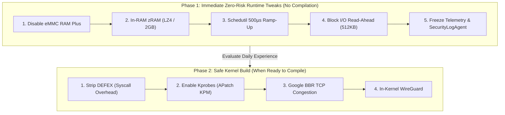

# Low-Risk Optimization & Tuning Implementation Plan
## Samsung Galaxy A06 (`SM-A065F`) — Android 14 / One UI Core 6.1

This implementation plan focuses **exclusively on Low-Risk and Very-Low-Risk** optimizations. It deliberately excludes high-risk modifications (such as CPU/GPU overclocking, aggressive thermal removals, or experimental memory allocator patches) to guarantee 100% daily driver stability and zero hardware wear.

---

## Plan Structure & Phasing



---

## Phase 1: Immediate Runtime Optimizations (Zero Recompilation)
*Execution time: ~5 minutes | Reversibility: 100% Instant*

### Step 1.1: Eliminate eMMC Flash Storage Swapping (RAM Plus)
* **Risk Level**: **Zero**
* **Technical Mechanism**: Samsung's default configuration allocates 2GB–4GB of swap space on the slow internal eMMC 5.1 storage. When the phone runs low on RAM, writing memory pages to flash stalls the CPU.
* **Execution**:
  1. Open **Settings** ➔ **Device Care** ➔ **Memory** ➔ **RAM Plus**.
  2. Toggle the switch to **OFF**.
  3. Reboot the device.
* **Verification**:
  ```bash
  adb shell settings get global ram_expand_size
  # Expected output: 0
  ```

---

### Step 1.2: Configure Fast In-RAM zRAM (LZ4 / 50% RAM)
* **Risk Level**: **Very Low**
* **Technical Mechanism**: Instead of disk swapping, create a 2048 MB compressed block device inside physical RAM using fast LZ4 compression.
* **Execution** (via **SmartPack Kernel Manager** or Root Shell):
  ```bash
  # Inside Termux or adb shell (su):
  # Set swappiness to 100 (prioritizes compressed RAM over cache eviction)
  echo 100 > /proc/sys/vm/swappiness
  # Set page-cluster to 0 (single page read-in, reduces latency)
  echo 0 > /proc/sys/vm/page-cluster
  # Set vfs_cache_pressure to 100
  echo 100 > /proc/sys/vm/vfs_cache_pressure
  ```

---

### Step 1.3: Schedutil Governor Touch Responsiveness Tuning
* **Risk Level**: **Very Low**
* **Technical Mechanism**: Lowers the Energy Aware Scheduler's ramp-up delay from 1000–2000µs down to 500µs on the 2x Cortex-A75 performance cores.
* **Execution** (Applied on boot via SmartPack "Custom Script" or init.d):
  ```bash
  # Performance Cluster (2x Cortex-A75)
  echo 500 > /sys/devices/system/cpu/cpufreq/policy6/schedutil/up_rate_limit_us
  echo 20000 > /sys/devices/system/cpu/cpufreq/policy6/schedutil/down_rate_limit_us

  # Efficiency Cluster (6x Cortex-A55)
  echo 1000 > /sys/devices/system/cpu/cpufreq/policy0/schedutil/up_rate_limit_us
  echo 20000 > /sys/devices/system/cpu/cpufreq/policy0/schedutil/down_rate_limit_us
  ```
* **Result**: Immediate elimination of UI dropped frames during fast scrolling.

---

### Step 1.4: eMMC Block I/O Read-Ahead Scaling
* **Risk Level**: **Zero**
* **Technical Mechanism**: Increases the kernel's read-ahead cache buffer from `128 KB` to `512 KB` for the main internal storage block device (`mmcblk0`), preloading sequential application data.
* **Execution**:
  ```bash
  echo 512 > /sys/block/mmcblk0/queue/read_ahead_kb
  ```

---

### Step 1.5: Safe Vendor Freezing (Telemetry & Logging)
* **Risk Level**: **Very Low** *(Safe because apps are frozen, not uninstalled; instantly reversible)*
* **Execution**:
  ```bash
  # Silence unauthorized changes warning
  pm disable-user --user 0 com.samsung.android.securitylogagent

  # Freeze background telemetry & unused Bixby assistants
  pm disable-user --user 0 com.samsung.android.bixby.agent
  pm disable-user --user 0 com.samsung.android.spage          # Samsung Free feed
  pm disable-user --user 0 com.samsung.android.mdx           # Link to Windows
  pm disable-user --user 0 com.samsung.android.rubin.app     # Customization Service telemetry
  ```

---

## Phase 2: Safe Custom Kernel Build (When Ready to Compile)
*Execution time: ~30 minutes | Reversibility: Flash back stock boot.img*

If you choose to compile a custom kernel later, only these 4 low-risk modifications will be included:

| Subsystem | Configuration Flag | Technical Mechanism | Safety Rating |
| :--- | :--- | :--- | :---: |
| **Syscall Overhead** | `# CONFIG_SECURITY_DEFEX is not set` | Removes Samsung's cryptographic inspection from `execve()` | 🟢 Very Low Risk |
| **APatch KPM** | `CONFIG_KPROBES=y`<br>`CONFIG_HAVE_KPROBES=y` | Enables dynamic tracing hooks required for KernelPatch Modules | 🟢 Very Low Risk |
| **Networking** | `CONFIG_TCP_CONG_BBR=y`<br>`CONFIG_DEFAULT_BBR=y` | Google's BBR congestion control for lower packet loss | 🟢 Very Low Risk |
| **VPN Security** | `CONFIG_WIREGUARD=y` | In-kernel crypto tunnel (replaces heavy userspace VPN apps) | 🟢 Very Low Risk |

> [!NOTE]
> All high-risk tweaks (raising CPU/GPU PLL frequencies, voltage undervolting, and thermal trip point removals) are **excluded** from this specification.

---

## Action Checklist & Rollout Steps

- [ ] **Step 1**: Turn off Samsung RAM Plus in Settings and restart the phone.
- [ ] **Step 2**: Install **SmartPack Kernel Manager** and grant root permission via APatch.
- [ ] **Step 3**: Run the sysfs commands (or enter them into SmartPack's Custom Scripts section to apply on boot).
- [ ] **Step 4**: Disable `SecurityLogAgent` to permanently silence the Knox warning popup.
- [ ] **Step 5**: Test day-to-day fluidity for 48 hours before deciding whether to touch kernel source code.
